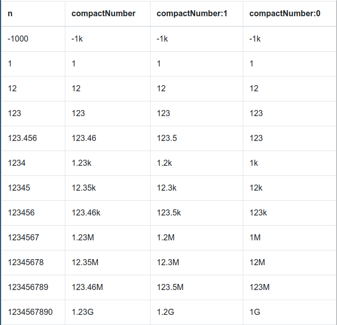

# ngx-compact-number [ ](https://app.codeship.com/projects/292340)

Display [big] numbers in [metric notation](https://en.wikipedia.org/wiki/Metric_prefix) (1.2k, 12M...) to gain some space:

`{{ 12000 | compactNumber }}  =>  '12k'` (see [more examples](#examples))

## Installation

### 1. Install with yarn or npm:

 - npm: `npm i ngx-compact-number`
 - yarn: `yarn add ngx-compact-number`

### 2. Add `NgxCompactNumberModule` to your `app.module.ts` file:

```app.module.ts
...
import { NgxCompactNumberModule } from 'ngx-compact-number'
...

@NgModule({
  declarations: [
    AppComponent
  ],
  imports: [
    ...
    NgxCompactNumberModule,
  ],
  providers: [],
  bootstrap: [AppComponent]
})
export class AppModule { }

```

## Usage

### Using the Pipe

Simply use `compactNumber` as a pipe for your number, _e.g._ `{{ 123456 | compactNumber }}` will print `123k`
You can also set a number of decimals as 2nd optional parameter, so that `{{ 123456 | compactNumber:1 }}` becomes `123.4k`
You can also pass a locale variable as third argument, which is passed to @angular's `DecimalPipe` pipe.

### Service

A service is available to format numbers in the same way:

```myComponent.ts
...
import { NgxCompactNumberService } from 'ngx-compact-number'
...
export class AppComponent {

  constructor(private compactNumberService: NgxCompactNumberService) {}
  ...
  
  public formatted = this.compactNumberService.format(123458, 2) // =>  '123,46k'
}

```

## Examples


